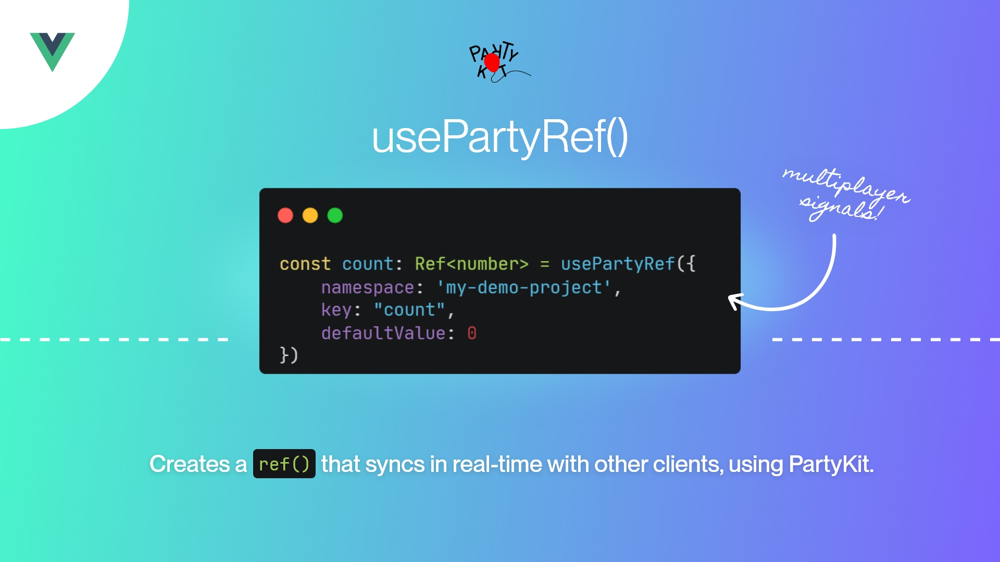

# usePartyRef



`usePartyRef()` is a Vue 3 composable that extends the functionality of the standard `ref()` to enable real-time,
synchronized state across multiple clients globally.

It transforms local reactive state into a shared state across all connected clients, allowing you to
build multiplayer interactive experiences using the Vue lifecycle hooks you're familiar with. The composable returns a `Ref`, so you
can `watch` it, bind it to inputs, run a `computed` on it, etc.

Under the hood, it's using [PartyKit](https://www.partykit.io/) stateful servers and websockets, based
on [CloudFlare Durable Objects](https://developers.cloudflare.com/durable-objects/) to keep values in sync and persist them beyond the life of the browser window. The library is written in TypeScript and is fully type-safe.

## 📦 Installation

Install `usePartyRef` via npm by running:

```bash
npm install usepartyref
```

---

## 🚀 Usage

Below is a comparison of using Vue's native `ref()` versus `usePartyRef()` to illustrate how you can seamlessly use
globally shared state as easily as using a normal ref:

```ts
// Use Vue's native ref() for local state
const count: Ref<number> = ref(0)

// Use usePartyRef() for shared state
const sharedCount: Ref<number> = usePartyRef({
    project: 'my-project', // Choose something unique
    name: "count",
    defaultValue: 0
})

// Computed, watch, and other reactive utilities work just like a normal ref
const doubled = computed(() => sharedCount.value * 2)
```

With `usePartyRef()`, the count state is synchronized in real time across all clients that subscribe to it. That might
be two browser tabs on your local machine, or another computer on the other side of the planet.

---

## 💪 Managed vs. Self-Hosting

`usePartyRef` is built on top of [PartyKit](https://www.partykit.io/), a managed service that handles the real-time
synchronization of state across clients. This means you don't need to worry about setting up your own server or managing
the infrastructure.

By default, `usePartyRef` uses the PartyKit server hosted on the package author's account that requires no setup on your part. This is great for getting started quickly and for small projects, but it's not recommended for production use. Under heavy traffic it may be rate limited, and there's a greater chance of namespace conflicts with other users.

### Self-host on your own PartyKit account:

1. Fork this repo
2. Run `server:deploy` and follow the prompts to authenticate with your own GitHub account to PartyKit
3. Configuring the `usePartyRef` composable to point at your own account by setting the `host` option:

```ts
const count: Ref<number> = usePartyRef({
    project: 'my-project',
    name: "count",
    defaultValue: 0,
    host: '[projectname].[username].partykit.dev' // server:deploy will give you this URL
})
```
Forking it and hosting on your own account also has the benefit of providing a level of privacy and control over your data. You can modify the PartySocket connection and the server to use your own authentication approaches along with any business logic you need - although at that point you may want to consider using PartyKit directly.

You can also go as far as actually **self-hosting on CloudFlare**. For that, see
the [PartyKit documentation](https://docs.partykit.io/guides/deploy-to-cloudflare/).

---

## 📚 Contributions

Contributions are welcome! Feel free to open an issue or submit a pull request if you have any ideas or improvements.

---

## 🔗 Links

- [PartyKit](https://partykit.io/)
- [Follow on Twitter](https://twitter.com/marchantweb)
- [Chat on Discord](https://discord.gg/hKyfDAddsK)

---

## 📄 License

Copyright (c) 2024 Simon Le Marchant _(Marchant Web, LLC.)_

`usePartyRef` is licensed under the [MIT License](https://github.com/vuexyz/vuexyz/blob/main/LICENSE). Licensed works,
modifications, and larger works may be distributed under different terms and without source code.
